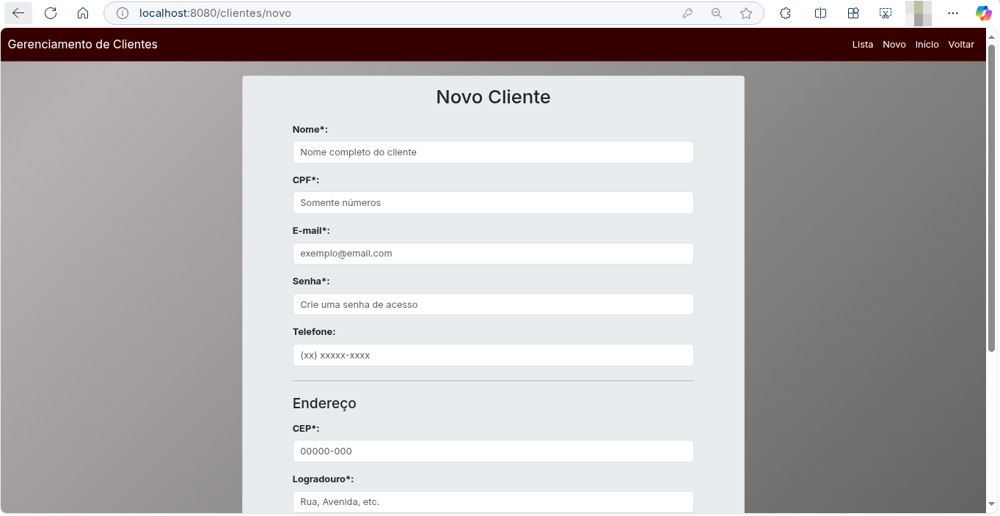

# Video Locadora

## Objetivos 

__Projeto como requisito parcial para a disciplina de Laborátório de Programaçao__

__O Sistema desenvolivido é um sistema para gerenciamento de catálogo, clientes e o relacionamento entre clientes de locadora via locação de vídeos__

## Introdução

A aplicação solicitada era uma que contemplasse um CRUD (CREATE, READ, UPDATE, DELETE) com um tema a escolha. A locadora foi escolhida por permitir, de maneira relativamente simples, a intereção entre duas entidades, e permitir uma construção simples e perto da realidade (mesmo que não existam mais locadoras de vídeos).

A aplicação é desenvolvida em java+spring boot, usado bootstrap para o frontend (mais modificações vis css). A ideia foi desenvolver uma API que utiliza-se um banco de dados em MySQL.  No diretorio, há controllers responsável por receber as requisições HTTP (GET, POST, etc.), para os filmes, clientes e locações e eviar para as services dessas entidades processar os dados, services essas que interegem com o repository, comunicando-se assim com o banco de dados.

Foi usado também JPA para validação antes de persistir os dados no banco de dados. Uma DTO também foi criada para uma trasfericia para o banco.

## Prints da aplicação

### Index - página de boas vindas

### Landing - Dashboard do locadora

Imaginada como um painel de controles para os administradores da locadora

### Listando clientes e Filmes

### Cadastrando

### Cadastrando uma nova Locação e Dando baixa após devolução

### Histórico de Locações

# Referências

 --- As imagens utilizadas na aplicação foram desenvolvidas utilizando o chatgpt, via intruções pelo prompt

